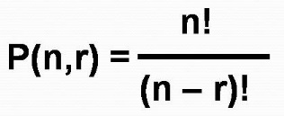

  

# Combinatorics (Permutation and Combination)

* @file : Permutation.ipynb and Combination.ipynb
* @author : Sinan KAMILCELEBI
* @version : V1.0.1
* @date : 22-March-2019
* @brief : Permutation and Combination Example.

# Permutation

## Örnek Soru:
<b>I)</b> Yaşları farklı x kardeş yan yana sıralanacaktır. En büyük kardeş bir uçta, en küçük kardeş ise diğer uçta olmak üzere bu sıralama işlemi kaç farklı şekilde yapılabilir? 

<b>II)</b> x mektup y posta kutusuna atılacaktır.   
<b>a)</b> Kaç farklı şekilde atılır?  
<b>b)</b> Her mektup farklı posta kutusuna atılmak şartıyla kaç farklı şekilde atılabilir?

## Çözüm:
<b>I)</b> Kardeşlerden en büyük ve en küçük olanını toplam kardeş sayısından çıkartıp (x - 2) sonucun faktöriyelini 2 ile çarptığımızda istenilen sonucu elde ederiz.  

<b>II-a)</b> Atılacak olan her mektup için aynı miktarda seçim hakkına sahip olduğumuz için x mektup y posta kutusuna  y ^ x farklı şekilde atılır.  

<b>II-b)</b> Her mektup farklı posta kutusuna atılmak şartıyla y'nin x elemanlı permütasyonlarının hesaplanmasıyla P(y, x) sonuç bulunur.

## Açıklamalar:

<b>I)</b> Bu soruda kardeş sayısını örnek olarak 6 alırsak eğer kardeşlerin sıralaması EB _ _ _ _ EK (6 - 2)! veya EK _ _ _ _ EB (6 - 2)! şeklinde olur ve bu iki farklı ifadenin toplam değeri ise (4! + 4! = 48) bize istenilen sonucu verir.  

<b>II-a)</b> Soruda hiçbir şart belirtilmediği için bu mektupları posta kutusuna aynı anda atabiliriz. Ve her mektup için de aynı miktarda seçim hakkına sahip olduğumuzdan dolayı saymanın çarpma kuralına göre işlem yaparız. 

<b>II-b)</b> Bir önceki sorunun aksine bir şart belirtildiği için her posta kutusuna atılacak mektup sayısı atılan posta kutusu sayısının yapılan işlemin ardından birer azaltılması ile bulunur. Örnek olarak 4 mektup 6 posta kutusuna 6 * 5 * 4 * 3 = 360 farklı şekilde atılabilir. 

# Combination

## Örnek Soru:
<b>A)</b> X = {1, 2, 3, ..., m} pozitif tamsıyılarından tüm 5 elemanlı kümelerinden üçte birinin 7 rakamını içerdiği bilindiğine göre m'yi bulunuz?

<b>B)</b> Bir yıldan x farklı gün seçilmiştir. Bu günler arasında her aydan 8 gün olma olasılığını bulunuz? (Her ayın 30 günden oluştuğunu kabul ediniz.) 

## Çözüm:
<b>A)</b> (1 / 3) * C(m, 5) = C(m - 1, 4) ifadesi çözümlendiğinde istenilen "m" değeri 15 olarak bulunur. Aşağıda yer alan programda kullanıcıdan doğru bulunan "m" değeri istenilmektedir. Programda kullanıcı tarafından girilen "m" değeri doğru veya yanlış olarak test edilerek kullanıcıya çıktı verilmektedir.

<b>B)</b> P(A) = (C(30, 8) ^ 12) / C(360, x) klavyeden girilen bir yıldaki x farkı gün sayısına göre istenilen durum, tüm duruma bölünerek olasılık değeri hesaplanmaktadır.

## Açıklamalar:

__Örnek A__'da; ilk olarak m'nin 5 elemanlı kombinasyonlarının sayısı (1 / 3) ile çarpılır ve bu beş elemanlı kümelerinin üçte birinin 7 rakamını içerdiğini bilindiği için (m - 1)'in 4 elemanlı kombinasyolarının sayısına eşitlenerek istenilen sonuç elde edilir.

__Örnek B__'de ise; ilk olarak istenilen durum her aydan 8 gün seçileceği belirtildiği için 30'un 8 elemanlı kombinasyonlarının sayısının 12. kuvveti alınarak (Bir yılda 12 ay var.) bulunur. Daha sonra ise tüm durum için, 360'ın bir yıldan seçilen gün sayısına göre kombinasyonu alınır. İstenilen olasılık hesaplaması için de istenilen durum, tüm duruma bölünerek işlem yapılır. 
